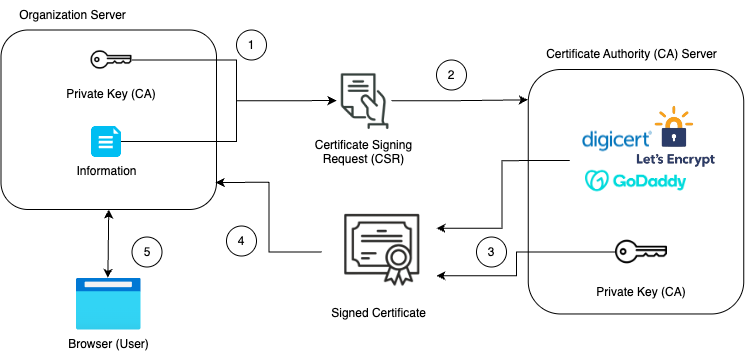

# CA (Certificate Authorities) and Certificates
### How websites prove they’re legit?
Our internet depends on encryption to protect our sensitive data from cyber attacks (phishing, spoofing, hacking). Without a way to verify the identity of a website, attackers could easily replicate a real website, tricking unsuspecting users into handing over their credentials or other sensitive information.

This is the problem that a Certificate Authority (CA) solves by validating website ownership and issuing TLS/SSL certificates.
> NOTE: TLS and SSL can be used interchangeably. TLS is a modern version of SSL
	
CA enables encryption between the browser (user) and the server. This encryption ensures that the data exchanged remains secure. Without a CA, online banking, shopping, and social media would be very risky to visit, as there would be no reliable way to verify a genuine website.

Keep in mind though, that just because a website has a certificate doesn't automatically mean it's secure. Hackers can still obtain **Domain Validated (DV) certificates** for fake websites. That's why businesses handling sensitive transactions often opt for **Organization Validated (OV) certificates** or **Extended Validation (EV) certificates**, which provide more validity.

### How CA's Validate a client?
Certificate Authority CA is the one who is responsible for giving websites a certificate so users can tell if they are legit. Certificate Authority (CA) are verified organizations like, LetsEncrpyt Digicert, GlobalSign, SSL Store. Before a CA issues a certificate, they verify important details about the requester

- DV certificates, the CA verifies that the applicant has control over the domain ( for personal websites )
- OV certificates, the CA confirms the organization's identity by referencing official government records.  (Commonly used for business and public-facing websites.)
- EV certificates, the CA conducts the most thorough validation process to ensure the business is legitimate. (High security websites like online banking, e-commerrce, government)

DV, OV, EV are types of SSL / TLS certificates, there are other types of digital certificates issued by CA's like which we won't go deep dive into, but here are some examples

- Device Certificates
- Code Signing Certificates
- Email Certificate
- Root Certificates
- **Self Signed Certificates** not trusted by browser will and is typically used for testing or internal purpose

### Flow of acquiring a certificate 

1. The organization creates a CSR (Certificate Signing Request) embedding their information and public key.
2. The organization submits the CSR to a Certificate Authority (CA), which verifies the details provided.
3. Once verified, the CA signs the CSR using its private key, creating a trusted certificate.
4. The organization receives the signed certificate and installs it on its server for secure communication.
5. When the client sends a request to the server, the server responds with its certificate, and the browser verifies it.
This process is an example of Public Key Infrastructure (PKI), which enables secure communication between clients and servers

### Public and Private CA
So far, we've been talking about public CAs, but what is a private CA?
When a company needs a secure internal system, it may face challenges managing SSL certificates. By using a private Certificate Authority (CA), the company can issue certificates that are trusted within its own network only. This is necessary to ensure that internal systems don't get flagged as insecure by browsers. Remember, browsers have built-in mechanisms for checking certificates. If a website doesn't have a trusted certificate, it will be marked as insecure.

### Certificates and Cloud Providers
Cloud providers offer tools for managing SSL/TLS certificates, automatic requesting for your domain names, automatic renewal of publicly issued certificates and it easily integrates with other resources like load balancer, Global CDN and service of cloud providers and, services within the cloud platform:

- **AWS**: AWS Certificate Manager (ACM)
- **Azure**: Azure Key Vault (Certificate Management)
- **Google Cloud**: Google Cloud Certificate Manager

Lastly, it's important to remember that CA certificates expire and must be renewed to remain trusted by clients. Renewing a CA certificate is usually pretty straightforward, just submit another Certificate Signing Request (CSR) and update your certificate.

And as always, we’re just scratching the surface, there's a lot more to learn in Certificates

Here are some questions you could ponder upon or dive into yourself
- How does end-to-end flow work from a server’s certificate issuance to browser retrieval and validation?
- TLS vs SSL: What's the difference? (Deep Dive)
- What is Certificate Chain? 

But that's the end for this blog, see ya on another blog and thanks for reading : )
